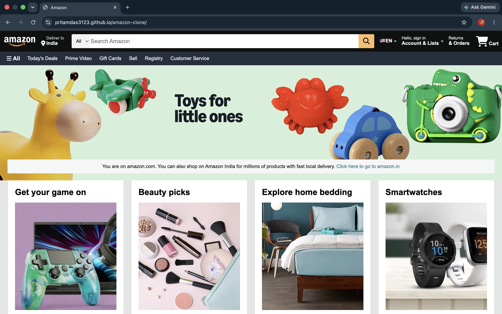

# Amazon Homepage Clone

Amazon's homepage, rebuilt from scratch in vanilla HTML and CSS — no frameworks, no libraries.

## Screenshot



## Features
- Flexbox-based navbar — logo, delivery location, search bar with category dropdown, language selector, account/orders/cart sections
- Secondary nav panel with category shortcuts (Today's Deals, Prime Video, Gift Cards, etc.)
- Hero banner with an overlapping product grid, using negative margins and `z-index` to mimic Amazon's signature layout
- Responsive 4-column product grid using `flex-wrap` and percentage-based widths
- Full 4-column footer with sitemap links, logo panel, and legal/copyright bar
- Hover states on nav icons and underline-on-hover links throughout

## Built with


## Live Demo
**[pritamdas3123.github.io/amazon-clone](https://pritamdas3123.github.io/amazon-clone/)**

## Run It Locally
```bash
git clone https://github.com/pritamdas3123/amazon-clone.git
cd amazon-clone
```
Then just open `index.html` in your browser — no build step, no dependencies, no installation required.

## Project Structure
```
amazon-clone/
├── index.html
├── style.css
├── screenshots/
│   └── screenshot.png
├── images/
│   ├── amazon_logo.png
│   ├── hero_section1.jpg
│   └── box1_image.jpg ... box8_image.jpg
└── README.md
```

## Possible Future Improvements
- Media queries for mobile/tablet breakpoints
- Convert the product grid to CSS Grid for easier responsive control
- Working search, cart, and account functionality with a backend

## Author
**Pritam Das**

[](https://github.com/pritamdas3123)
[](https://www.linkedin.com/in/pritamdas3123)
[](mailto:pritamdas3123@gmail.com)